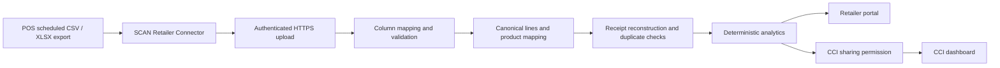

# SCAN

**Sales & Consumption Analytics Network**

[](https://github.com/HuseynBlv/SCAN/actions/workflows/ci.yml)

Turn retailer receipt exports into practical market intelligence for **retailer owners** and
approved basket insights for **CCI Sales and Marketing**.

SCAN is an analytics and data-collaboration layer for medium-sized formal retailers that
already use a digital checkout system. It uses the transaction data they already generate.
Cashiers do not scan products into SCAN, and SCAN does not replace a POS, cash register,
inventory system, or ERP.

**Current stage:** a working pilot prototype with CSV/XLSX ingestion, a tested unattended
retailer connector, deterministic analytics, separate retailer/CCI portal access, and a
responsive briefing-first interface based on the shared SCAN design system. A reproducible
Kaggle demo exercises the pipeline. The
single-container application is live on Render Free at
[scan-demo.onrender.com](https://scan-demo.onrender.com), backed by Neon Free PostgreSQL over
verified TLS. Real-retailer validation remains next.

## What SCAN helps answer

- What do shoppers buy alongside CCI products?
- Which companion products and categories appear most often in CCI baskets?
- How do CCI penetration and basket value differ between stores?
- When does basket activity occur?
- Which observed relationships are worth testing through a bundle or joint display?

Recommendations follow **Fact → Interpretation → Recommended Action**. Numbers come from
the analytics engine, not an LLM. An observed relationship suggests a test; it does not
prove that a promotion will increase sales.

## The working product

| Portal | What it shows today |
|---|---|
| Retailer Overview | Three-things briefing, KPI strip, sales trend, top products, recommended actions, and sync freshness |
| Retailer Products & Categories | Top products and categories by imported line revenue |
| Retailer Time & Stores | Daypart, weekday/weekend, and store performance |
| Retailer Recommendations | Rule-based facts, interpretations, and suggested actions |
| Retailer Data Sync | Latest received file, completion state, counts, mapping gaps, and errors |
| CCI Overview | Three-things briefing, basket KPIs, companion-category signal, top companions, actions, and data confidence |
| CCI analysis pages | Approved companion product/category, CCI SKU, time/store, and recommendation analytics |

Retailer analytics support today, last 7 days, last 30 days, and all-time periods. CCI companion
rankings remain across all CCI baskets rather than a selected SKU. Period-over-period changes
and CCI-side date/store/SKU filters are not implemented yet.

### Interface principles

- **Briefing before exploration:** each Overview starts with observed facts and interpretations,
  then exposes KPIs, evidence, and recommended actions.
- **One product, two permission views:** retailer and CCI portals share navigation, typography,
  interaction, responsive behavior, and accessibility patterns while exposing different data.
- **No invented comparisons:** visual polish does not add peer benchmarks, forecasts, uplift,
  or period changes that the analytics API does not calculate.
- **Visible data trust:** mapping coverage, import freshness, demo-data notices, denominators,
  and privacy boundaries remain prominent.

The implementation tokens and component rules are documented in [DESIGN.md](DESIGN.md).

### From export to insight



- **Repeatable imports:** uploading identical bytes returns the active/completed import job;
  a failed file can be retried as a new numbered attempt. Concurrent imports for one retailer
  are serialized, and identical receipts in overlapping files are skipped without double-counting.
- **Safe failures:** malformed transaction uploads write no receipts. Receipt writes and job
  completion are atomic; reusing a receipt identity with different contents rejects the import
  rather than silently changing history.
- **Explicit product mapping:** exact barcodes, saved retailer mappings, and manual/catalog
  mapping; canonical names have a stable case-insensitive identity, with no fuzzy or AI matching.
- **Traceability:** import jobs retain status, counts, and validation errors.
- **Separation of access:** connector credentials can only upload for their server-bound pilot;
  retailer credentials can only read the server-bound retailer portal; CCI receives aggregate
  analytics only for retailers with sharing enabled; administrative imports/mappings stay separate.

See the [data contract](docs/pilot-data-contract.md) and
[metric definitions](docs/analytics-definitions.md) for exact rules and denominators.

## Reproducible demo

The [Kaggle demo guide](docs/kaggle-demo.md) prepares and imports a deterministic sample of
complete receipts. For the source ZIP identified in that guide, the verified result is:

| Check | Expected result |
|---|---:|
| Complete baskets | 10,000 |
| Transaction lines | 54,848 |
| Stores | 21 |
| Baskets containing mapped CCI products | 209 |
| CCI basket penetration | 2.1% |
| Mapped transaction lines | 100% |

These are technical demo results, **not current retailer or CCI market evidence**. The
adapter uses explicit assumptions for quantity, prices, currency, and product classification.
Mapping coverage measures linked lines, not independent confirmation that every label is
correct. Raw downloads and generated data are not committed to this repository.

## Run locally

### Requirements

- Java 21 and Maven 3.6.3+; CI uses Java 21.
- Node.js 24 and npm; CI uses Node.js 24.
- Either the configured Neon development workflow or a running local PostgreSQL server with
  a `scan` database and a login allowed to create its schema.

No AI API key, Supabase account, or camera is needed for the current dashboard.

### 1. Start the API with Neon

Authenticate the Neon CLI once, create a private local config, and start the API:

```bash
neon auth
cp .env.example .env.neon
# Edit .env.neon and replace all four SCAN application password placeholders.
bash scripts/run-neon-api.sh
```

The repository is linked to the `production` branch of Neon project
`withered-darkness-12839995`. The launcher targets the app-owned `scan` database as role
`scan_app`, retrieves its direct connection URI through the authenticated Neon CLI, converts
it to a verified-TLS JDBC URL, and passes the database credential only to the Spring Boot
process. It does not write the database password to disk. `.env.neon` and the machine-local
`.neon` context are ignored by Git.

`SCAN_ADMIN_PASSWORD`, `SCAN_CCI_PASSWORD`, `SCAN_INGEST_PASSWORD`, and
`SCAN_RETAILER_PASSWORD` belong in `.env.neon`; they protect distinct pilot roles and are
unrelated to Neon account/database credentials. The root
[`.env.example`](.env.example) documents the supported local overrides.

The global Codex Neon MCP connection is project-scoped and read-only, and exposes only
project/branch inspection, schema/query reading, observability, and documentation tools.
Restart Codex after first-time setup so a new task can load those tools. Database changes
continue to use the explicit CLI/application workflow.

### Local PostgreSQL alternative

From the repository root, in the backend terminal:

```bash
cd scan-api
export SCAN_DB_URL='jdbc:postgresql://localhost:5432/scan'
export SCAN_DB_USERNAME='scan'
export SCAN_DB_PASSWORD='replace-with-your-database-password'
export SCAN_ADMIN_PASSWORD='choose-a-local-admin-password'
export SCAN_CCI_PASSWORD='choose-a-local-cci-password'
export SCAN_INGEST_PASSWORD='choose-a-local-connector-password'
export SCAN_RETAILER_PASSWORD='choose-a-local-retailer-password'
export SCAN_PILOT_RETAILER_CODE='KAGGLE'
export SCAN_PILOT_PROFILE_CODE='KAGGLE_2019'
mvn spring-boot:run
```

Use your own passwords and keep them out of Git. Environment variables apply to the terminal
where they are set. With either database path, Flyway creates the schema and seeds the `DEMO`
and `KAGGLE` profiles; it does **not** automatically import transaction files.

See the [backend guide](scan-api/README.md) for database setup and API examples.

### 2. Load data

Follow the [Kaggle demo guide](docs/kaggle-demo.md): prepare the ZIP, import its product
catalog, then import transactions. If that sample is already loaded, skip this step.

Without the download, use the small synthetic fixture in the
[backend guide](scan-api/README.md#exercise-the-phase-0-api) and sign in with retailer code
`DEMO` instead. Its results will differ from the Kaggle table above.

### 3. Start the dashboard

From the repository root, in a second terminal:

```bash
cd scan-app
npm ci
npm run dev
```

Open the URL Vite prints, usually `http://localhost:5173`, then sign in:

- Retailer owner portal: `http://localhost:5173/?portal=retailer`, username `scan-retailer`,
  password `SCAN_RETAILER_PASSWORD`.
- CCI portal: `http://localhost:5173/`, retailer `KAGGLE` (or `DEMO` for the small fixture),
  username `scan-cci`, password `SCAN_CCI_PASSWORD`.

Vite forwards `/api` requests to `localhost:8080` during development. The frontend holds
credentials in memory only; reloading the page requires signing in again.

### A short demo walkthrough

1. Start the connector and run `bash scripts/simulate-retailer-export.sh`.
2. Open the retailer portal **Data Sync** page and show the completed automatic import.
3. Use **Overview**, **Products & Categories**, and **Time & Stores** to show retailer value.
4. Open the CCI portal and explain that it receives only approved aggregate basket intelligence.
5. Simulate the same export again and verify unchanged basket totals, demonstrating idempotency.

## Tests and continuous integration

From the repository root:

```bash
(cd scan-api && mvn verify)
(cd scan-connector && mvn verify)
(cd scan-app && npm test && npm run lint && npm run build)
```

Backend tests use an isolated H2 database; they do not need or modify local PostgreSQL.
`mvn verify` produces `scan-api/target/site/jacoco/index.html` and enforces at least 80% line
and 55% branch coverage. Coverage is a regression guard, not proof of business correctness.
An opt-in full-sample smoke test also checks the verified 10,000-basket result and enforces a
five-second local analytics budget after import.

GitHub Actions runs backend, connector, and frontend verification on pull requests and pushes
to `main`, then builds the deployable Docker image and smoke-tests it against
disposable PostgreSQL 18 under a 512 MB app memory limit. Workflow actions are pinned to
immutable commits, and Dependabot checks application, container, and CI dependencies monthly.
See the
[container test instructions](docs/free-demo-deployment.md#local-container-verification).
The optional 10,000-basket tests require locally generated files; they are not part of normal CI.

## Privacy and pilot boundaries

- Customer names, phone numbers, loyalty/card identifiers, bank credentials, and cashier
  personal information are not required. Remove them before sharing or importing exports.
- CCI, retailer, connector, and administrator accounts have separate endpoint permissions.
  Pilot connector/retailer identities are bound server-side to one configured retailer/profile.
- Environment-configured Basic Auth accounts are for the single-retailer pilot. Multiple
  retailers require database-backed accounts, credential rotation, and per-retailer membership.
- Positive sales are supported. Returns, voids, taxes, and receipt-level discount semantics
  must be confirmed with a real retailer before their data is considered decision-ready.
- Monetary analytics refuse to combine receipts from multiple currencies. A retailer export
  must use one confirmed currency per analytical dataset until explicit conversion is designed.
- Imports are synchronous, limited to 25 MB, and spreadsheet parsing uses the first worksheet.
  Analytics use database aggregates plus compact receipt summaries for time/store metrics; larger
  workloads and concurrent analytical traffic are not validated.
- Receipt identity currently includes retailer, store, receipt ID, and timestamp. Verify this
  against the retailer's actual receipt-number reuse rules.
- The connector automates delivery after a POS creates a file. It does not make every POS capable
  of scheduled exports; systems without that feature need a source-specific read-only adapter.
- No promotion-effectiveness calculation or browser mapping workflow is implemented yet.

## Deployment status

The [free-demo deployment guide](docs/free-demo-deployment.md) uses **one Render Free service
for both React and Spring Boot**, with PostgreSQL on **Neon Free**. The root Dockerfile packages
the dashboard into the Java application. One HTTPS origin serves the page and `/api`, so no
cross-origin configuration is needed. `render.yaml` explicitly selects the free instance and
manual deployment. The service now follows `main`; commit `746461d` was the latest hosted
baseline verified before the Phase 3 UI branch at
[https://scan-demo.onrender.com](https://scan-demo.onrender.com): the React root returned 200,
`GET /health` returned `{"status":"UP"}`, the unauthenticated analytics route returned 401,
and startup logs confirmed Flyway schema version 4 on Neon PostgreSQL 18.6. The hosted import
was then verified at 10,000 baskets and 54,848 lines with 100% mapping; a repeat upload returned
`duplicateFile: true` without changing totals. Authenticated analytics returned the expected
209 CCI baskets and 2.1% penetration across all five dashboard sections.

Free services can sleep, start slowly, or stop at quota limits. This is an occasional technical
demo, not a production availability commitment. The guide covers account setup, runtime
secrets, imports, verification, limits, and manual deployment from `main`.

A successful frontend-only Vercel build does not deploy Spring Boot or make API sign-in work.
The Vite development proxy is not included in production builds. A separately hosted frontend
still needs explicit API routing or implemented and tested CORS; `VITE_SCAN_API_BASE_URL`
alone is not enough. Existing Vercel configuration is unchanged.

Never put passwords in `VITE_*` variables: those values are embedded in the browser bundle.
The GitHub repository has an existing Vercel integration, so merging into its production
branch can update the public frontend. Verify backend routing before presenting that URL
as a working analytics demo.

Before putting real or non-public data in Neon, reset the default `neondb_owner` password in
the Neon Console because its original connection string was shared outside a secret manager.
SCAN does not use that role, so rotating it will not affect the `scan_app` connection.

## Troubleshooting

| Symptom | Check |
|---|---|
| API startup fails with connection refused on port 5432 | PostgreSQL must be running on the host and port in `SCAN_DB_URL`. Read the final database error; the Maven `sun.misc.Unsafe` warning alone is not the cause. |
| API returns 401 | Use `scan-admin` for imports or `scan-cci` for analytics, with the corresponding backend password. `curl -u scan-admin` prompts safely for the password. |
| API returns 403 | The account may lack the required role, or CCI sharing is disabled for that retailer. |
| Dashboard has no baskets | Confirm the retailer code and import transactions; migrations create profiles, not transaction history. |
| Hosted sign-in fails while local sign-in works | Check the hosted API route. A frontend-only deployment does not include Spring Boot. |

## Next milestones

1. **Validate one real retailer export:** configure its scheduled export, import complete receipts, resolve product mappings,
   and reconcile receipt counts and sales totals against the source system.
2. **Make the analysis decision-specific:** date/store/SKU filters, matching comparison
   periods, visible denominators, and minimum-sample safeguards for recommendations.
3. **Harden multi-retailer onboarding:** database-backed accounts/connectors, credential
   rotation, validation reports, unresolved-product review, and import history.
4. **Run one measurable pilot:** agree on a bundle/display test and its success measure;
   deploy a secured, accessible demo once the hosting and sharing scope are agreed.

These are planned improvements, not claims about the current feature set.

## Repository and documentation

```text
SCAN/
├── .github/                   # CI plus monthly dependency update configuration
├── DESIGN.md                  # Approved UI system, tokens, components, and guardrails
├── Dockerfile                 # Builds React into the Java 21 application
├── render.yaml                # One Free web service; runtime secrets only
├── scripts/                   # Isolated deployment smoke test
├── docs/                      # Data contract, metrics, demo, and hosting runbook
├── scan-api/                  # Java / Spring Boot, JPA, PostgreSQL, Flyway
│   └── src/                   # Ingestion, catalog, analytics, security, and tests
├── scan-connector/            # Java shop-side folder monitor and HTTPS uploader
└── scan-app/                  # React 19, Vite, Recharts, Vitest
    └── src/
        ├── AppLoader.jsx      # Default dashboard / explicit legacy switch
        ├── components/        # Retailer and CCI dashboards and tests
        ├── services/scanApi.js
        └── App.jsx            # Preserved original scanner
```

- [Backend setup and API examples](scan-api/README.md)
- [Frontend setup and configuration](scan-app/README.md)
- [Reproducible Kaggle demo](docs/kaggle-demo.md)
- [Free Render + Neon demo deployment](docs/free-demo-deployment.md)
- [Retailer connector setup and demonstration](docs/retailer-connector.md)
- [Pilot data contract and retailer questions](docs/pilot-data-contract.md)
- [Analytics definitions and insight rules](docs/analytics-definitions.md)

## Legacy scanner

The original hackathon prototype remains intact for reference. To run it explicitly from
`scan-app/`:

```bash
VITE_ENABLE_LEGACY_SCANNER=true npm run dev
```

<details>
<summary>Original scanner capabilities and demo notes (not the current product)</summary>

The original React prototype paired a mobile cashier view with an HQ analytics view. It
included camera barcode scanning with `@zxing/browser`, duplicate-scan protection, scan
feedback/vibration, basket logging, My Store analytics, rewards, rankings, and simulated
scans in Demo Mode. Its HQ view included KPI cards, product pairs, district comparisons,
peak hours, and a transaction feed. It used CCI-red branding (`#E61C24`), a splash screen,
and a cashier/HQ mode switcher.

Product lookup used Open Food Facts with a small fallback catalog (Coca-Cola 330ml,
Lays Original, and Azerchay Black Tea). Camera decoding runs in the browser; the fallback
catalog helps when lookup is unavailable, but this is not an offline guarantee for the new
analytics dashboard.

For phone camera access, use HTTPS through a hosted frontend or a secure development
tunnel. The legacy presentation flow was Cashier View → Demo Mode/scanning → log basket →
HQ View. Rewards, scanner-generated baskets, and this demo flow do not power the current
retailer-export analytics pipeline.

</details>

## Data credits

The current technical demo uses the
[Kaggle supermarket dataset](https://www.kaggle.com/datasets/mexwell/supermarket-dataset);
source attribution and transformation assumptions are in the [demo guide](docs/kaggle-demo.md).
The legacy scanner uses public food-product data from
[Open Food Facts](https://world.openfoodfacts.org/).
