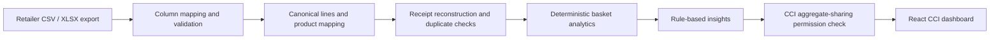

# SCAN

**Sales & Consumption Analytics Network**

[](https://github.com/HuseynBlv/SCAN/actions/workflows/ci.yml)

Turn retailer receipt exports into basket intelligence and practical actions for
**CCI Sales and Marketing**.

SCAN is an analytics and data-collaboration layer for medium-sized formal retailers that
already use a digital checkout system. It uses the transaction data they already generate.
Cashiers do not scan products into SCAN, and SCAN does not replace a POS, cash register,
inventory system, or ERP.

**Current stage:** a working local pilot prototype with CSV/XLSX ingestion, deterministic
analytics, and an API-backed React dashboard. A reproducible Kaggle demo exercises the full
pipeline. Real-retailer validation and production deployment remain next steps.

## What SCAN helps answer

- What do shoppers buy alongside CCI products?
- Which companion products and categories appear most often in CCI baskets?
- How do CCI penetration and basket value differ between stores?
- When does basket activity occur?
- Which observed relationships are worth testing through a bundle or joint display?

Recommendations follow **Fact → Interpretation → Recommended Action**. Numbers come from
the analytics engine, not an LLM. An observed relationship suggests a test; it does not
prove that a promotion will increase sales.

## The working product

| Dashboard section | What it shows today |
|---|---|
| Overview | Basket count, CCI baskets, penetration, average basket value, mapping coverage, and up to three insights |
| Basket Analysis | Top mapped non-CCI companion products and categories, with attachment rates |
| Product Performance | CCI SKU basket counts, quantities, and imported line-value totals |
| Time & Store | Daypart and weekday/weekend basket distribution, plus store-level comparisons |
| Recommendations | Rule-based facts, interpretations, and suggested actions |

All five sections use the same backend aggregate response. Current companion rankings are
across all CCI baskets, not a selected SKU; time distributions describe all imported baskets.
Date/store/SKU filters and period-over-period changes are not implemented yet.

### From export to insight



- **Repeatable imports:** uploading identical bytes returns the original import job;
  identical receipts in overlapping files are skipped without double-counting.
- **Safe failures:** malformed transaction uploads write no receipts. Reusing a receipt
  identity with different contents rejects the import rather than silently changing history.
- **Explicit product mapping:** exact barcodes, saved retailer mappings, and manual/catalog
  mapping; no fuzzy or AI product matching.
- **Traceability:** import jobs retain status, counts, and validation errors.
- **Separation of access:** import and mapping endpoints are admin-only. CCI receives
  aggregate analytics only for retailers with CCI sharing enabled.

See the [data contract](docs/pilot-data-contract.md) and
[metric definitions](docs/analytics-definitions.md) for exact rules and denominators.

## Reproducible demo

The [Kaggle demo guide](docs/kaggle-demo.md) prepares and imports a deterministic sample of
complete receipts. For the source ZIP identified in that guide, the verified result is:

| Check | Expected result |
|---|---:|
| Complete baskets | 10,000 |
| Transaction lines | 54,848 |
| Stores | 21 |
| Baskets containing mapped CCI products | 209 |
| CCI basket penetration | 2.1% |
| Mapped transaction lines | 100% |

These are technical demo results, **not current retailer or CCI market evidence**. The
adapter uses explicit assumptions for quantity, prices, currency, and product classification.
Mapping coverage measures linked lines, not independent confirmation that every label is
correct. Raw downloads and generated data are not committed to this repository.

## Run locally

### Requirements

- Java 21 and Maven 3.6.3+; CI uses Java 21.
- Node.js 24 and npm; CI uses Node.js 24.
- A running PostgreSQL server, with a `scan` database and a login allowed to create its schema.

No AI API key, Supabase account, or camera is needed for the current dashboard.

### 1. Start the API

From the repository root, in the backend terminal:

```bash
cd scan-api
export SCAN_DB_URL='jdbc:postgresql://localhost:5432/scan'
export SCAN_DB_USERNAME='scan'
export SCAN_DB_PASSWORD='replace-with-your-database-password'
export SCAN_ADMIN_PASSWORD='choose-a-local-admin-password'
export SCAN_CCI_PASSWORD='choose-a-local-cci-password'
mvn spring-boot:run
```

Use your own passwords and keep them out of Git. Environment variables apply to the terminal
where they are set. Flyway creates the schema and seeds the `DEMO` and `KAGGLE` profiles;
it does **not** automatically import transaction files.

See the [backend guide](scan-api/README.md) for database setup and API examples.

### 2. Load data

Follow the [Kaggle demo guide](docs/kaggle-demo.md): prepare the ZIP, import its product
catalog, then import transactions. If that sample is already loaded, skip this step.

Without the download, use the small synthetic fixture in the
[backend guide](scan-api/README.md#exercise-the-phase-0-api) and sign in with retailer code
`DEMO` instead. Its results will differ from the Kaggle table above.

### 3. Start the dashboard

From the repository root, in a second terminal:

```bash
cd scan-app
npm ci
npm run dev
```

Open the URL Vite prints, usually `http://localhost:5173`, then sign in:

- Retailer: `KAGGLE` for the prepared sample, or `DEMO` for the synthetic fixture.
- Username: `scan-cci`.
- Password: the value you set for `SCAN_CCI_PASSWORD` in the backend terminal.

Vite forwards `/api` requests to `localhost:8080` during development. The frontend holds
credentials in memory only; reloading the page requires signing in again.

### A short demo walkthrough

1. Start on **Overview**: explain the imported basket count, CCI penetration, and mapping coverage.
2. Open **Basket Analysis**: identify a companion and explain its attachment-rate denominator.
3. Use **Product Performance** and **Time & Store** to compare SKUs and stores without claiming causation.
4. Finish on **Recommendations**: choose one action to test, not a guaranteed sales outcome.
5. Re-upload the same transaction file and refresh: `duplicateFile: true` and unchanged totals
   demonstrate that repeat uploads do not inflate the story.

## Tests and continuous integration

From the repository root:

```bash
(cd scan-api && mvn verify)
(cd scan-app && npm test && npm run lint && npm run build)
```

Backend tests use an isolated H2 database; they do not need or modify local PostgreSQL.
`mvn verify` produces `scan-api/target/site/jacoco/index.html` and enforces at least 80% line
and 55% branch coverage. Coverage is a regression guard, not proof of business correctness.

GitHub Actions runs backend verification and frontend tests, lint, and build on pushes and
pull requests. The optional 10,000-basket smoke test requires locally generated files and is
documented in the [demo guide](docs/kaggle-demo.md#optional-real-volume-smoke-test).

## Privacy and pilot boundaries

- Customer names, phone numbers, loyalty/card identifiers, bank credentials, and cashier
  personal information are not required. Remove them before sharing or importing exports.
- CCI accounts cannot access the admin import/mapping endpoints. Sharing is currently a
  retailer-level switch, not a complete per-user/per-retailer permission system.
- Shared environment-configured Basic Auth accounts are for the pilot. Production needs
  HTTPS, account management, retailer-scoped access, and an agreed data-sharing policy.
- Positive sales are supported. Returns, voids, taxes, and receipt-level discount semantics
  must be confirmed with a real retailer before their data is considered decision-ready.
- Imports are synchronous, limited to 25 MB, and spreadsheet parsing uses the first worksheet.
  Analytics load the selected retailer's receipts into memory. Larger workloads are not validated.
- Receipt identity currently includes retailer, store, receipt ID, and timestamp. Verify this
  against the retailer's actual receipt-number reuse rules.
- No live POS connector, scheduled synchronization, promotion-effectiveness calculation,
  browser upload/mapping workflow, or separate retailer dashboard is implemented yet.

## Deployment status

The working local setup includes **both** the React frontend and the Spring Boot/PostgreSQL
backend. A successful Vercel frontend build does not deploy the backend or make API sign-in work.

Frontend build settings: root `scan-app`, build `npm run build`, output `dist`.
For a hosted pilot, serve the frontend and `/api` under the same HTTPS origin using a reverse
proxy, or explicitly implement and test cross-origin access. The Vite development proxy is
not part of the production build. `VITE_SCAN_API_BASE_URL` alone does not enable cross-origin
requests; the backend does not currently configure CORS permissions.

Never put passwords in `VITE_*` variables: those values are embedded in the browser bundle.
The GitHub repository has an existing Vercel integration, so merging into its production
branch can update the public frontend. Verify backend routing before presenting that URL
as a working analytics demo.

## Troubleshooting

| Symptom | Check |
|---|---|
| API startup fails with connection refused on port 5432 | PostgreSQL must be running on the host and port in `SCAN_DB_URL`. Read the final database error; the Maven `sun.misc.Unsafe` warning alone is not the cause. |
| API returns 401 | Use `scan-admin` for imports or `scan-cci` for analytics, with the corresponding backend password. `curl -u scan-admin` prompts safely for the password. |
| API returns 403 | The account may lack the required role, or CCI sharing is disabled for that retailer. |
| Dashboard has no baskets | Confirm the retailer code and import transactions; migrations create profiles, not transaction history. |
| Hosted sign-in fails while local sign-in works | Check the hosted API route. A frontend-only deployment does not include Spring Boot. |

## Next milestones

1. **Validate one real retailer export:** import complete receipts, resolve product mappings,
   and reconcile receipt counts and sales totals against the source system.
2. **Make the analysis decision-specific:** date/store/SKU filters, matching comparison
   periods, visible denominators, and minimum-sample safeguards for recommendations.
3. **Make onboarding demonstrable:** a browser upload, validation report, unresolved-product
   review, and import history above the existing API.
4. **Run one measurable pilot:** agree on a bundle/display test and its success measure;
   deploy a secured, accessible demo once the hosting and sharing scope are agreed.

These are planned improvements, not claims about the current feature set.

## Repository and documentation

```text
SCAN/
├── .github/workflows/ci.yml    # Backend and frontend checks
├── docs/                      # Data contract, metrics, and reproducible demo
├── scan-api/                  # Java / Spring Boot, JPA, PostgreSQL, Flyway
│   └── src/                   # Ingestion, catalog, analytics, security, and tests
└── scan-app/                  # React 19, Vite, Recharts, Vitest
    └── src/
        ├── AppLoader.jsx      # Default dashboard / explicit legacy switch
        ├── components/        # CCI dashboard and tests
        ├── services/scanApi.js
        └── App.jsx            # Preserved original scanner
```

- [Backend setup and API examples](scan-api/README.md)
- [Frontend setup and configuration](scan-app/README.md)
- [Reproducible Kaggle demo](docs/kaggle-demo.md)
- [Pilot data contract and retailer questions](docs/pilot-data-contract.md)
- [Analytics definitions and insight rules](docs/analytics-definitions.md)

## Legacy scanner

The original hackathon prototype remains intact for reference. To run it explicitly from
`scan-app/`:

```bash
VITE_ENABLE_LEGACY_SCANNER=true npm run dev
```

<details>
<summary>Original scanner capabilities and demo notes (not the current product)</summary>

The original React prototype paired a mobile cashier view with an HQ analytics view. It
included camera barcode scanning with `@zxing/browser`, duplicate-scan protection, scan
feedback/vibration, basket logging, My Store analytics, rewards, rankings, and simulated
scans in Demo Mode. Its HQ view included KPI cards, product pairs, district comparisons,
peak hours, and a transaction feed. It used CCI-red branding (`#E61C24`), a splash screen,
and a cashier/HQ mode switcher.

Product lookup used Open Food Facts with a small fallback catalog (Coca-Cola 330ml,
Lays Original, and Azerchay Black Tea). Camera decoding runs in the browser; the fallback
catalog helps when lookup is unavailable, but this is not an offline guarantee for the new
analytics dashboard.

For phone camera access, use HTTPS through a hosted frontend or a secure development
tunnel. The legacy presentation flow was Cashier View → Demo Mode/scanning → log basket →
HQ View. Rewards, scanner-generated baskets, and this demo flow do not power the current
retailer-export analytics pipeline.

</details>

## Data credits

The current technical demo uses the
[Kaggle supermarket dataset](https://www.kaggle.com/datasets/mexwell/supermarket-dataset);
source attribution and transformation assumptions are in the [demo guide](docs/kaggle-demo.md).
The legacy scanner uses public food-product data from
[Open Food Facts](https://world.openfoodfacts.org/).
