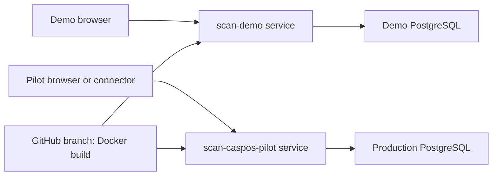

# SCAN demo and CASPOS pilot hosting for $0

The repository defines a technical demo and a separate pilot service. They must use different
PostgreSQL databases and database credentials. The synthetic demo is live at
[https://scan-demo.onrender.com](https://scan-demo.onrender.com); `scan-caspos-pilot` is the
production pilot identity. Never point the pilot at the demo database. SCAN also records an
environment claim inside each database and refuses to start when a demo/production identity does
not match.

## How it works



The root `Dockerfile` builds React, copies its production files into the Java application,
and packages everything in a Java 21 container. Node and Maven are build tools only; they
do not run in the final service. Spring Boot serves the dashboard at `/` and the API at
`/api/v1/...`, so browser requests stay on the same origin. No CORS change or Vercel proxy
is needed for this demo.

Only the page assets and minimal `GET /health` response are public. Each deployment has unique
account usernames. Data administrators, connectors, and retailer users are persisted with one
retailer binding; import accounts also carry one profile binding. CCI accounts can read aggregates
only for retailers with CCI sharing enabled.
Passwords stay in Render's environment settings and in browser memory during sign-in, not
in the frontend build or Git. Use **new, different hosted passwords**, not the local ones.

Flyway creates the database schema on startup. Imported receipts, mappings, and job history
live in Neon and survive app restarts. Uploaded source files are not archived by SCAN: retain
secure originals locally. Never rely on the container filesystem for durable data.

## 1. Use the configured Neon Free database

The verified Neon resources are:

| Resource | Value |
|---|---|
| Organization | `SCAN` (`org-orange-lake-78991410`) |
| Project | `SCAN` (`withered-darkness-12839995`) |
| Region / PostgreSQL | AWS Frankfurt / PostgreSQL 18 |
| Branch | `production` |
| Application database | `scan` |
| Application role | `scan_app` |

The application role owns its database and can run Flyway without using the default
`neondb_owner` role. Keep the role password private and enter it directly into Render in the
next step; do not paste credentials into chat, GitHub, source files, or deployment logs.

Before importing real or non-public data, reset the original `neondb_owner` password from
Neon's **Connect** dialog. Its first connection string was shared outside a secret manager.
The deployed application does not use that role, so this rotation does not change the Render
variables below.

Use this **direct JDBC** URL:

```text
jdbc:postgresql://ep-weathered-haze-b1xkw5un.c-5.eu-central-1.aws.neon.tech:5432/scan?sslmode=verify-full&sslfactory=org.postgresql.ssl.DefaultJavaSSLFactory
```

Do not use the `-pooler` hostname for this initial deployment: SCAN's datasource also runs
Flyway migrations. Do not include the username or password in the URL; supply them as separate
variables. Retrieve the current private connection details from Neon when needed:

```bash
neon connection-string production \
  --project-id withered-darkness-12839995 \
  --role-name scan_app \
  --database-name scan
```

Run that only in your private terminal. The command displays a credential, so never paste its
output into chat. For local development, prefer `bash scripts/run-neon-api.sh`; it retrieves
the same value in memory without displaying or storing the database password.

`verify-full` checks the server certificate and hostname, using Java's default trusted CAs.
Do not remove TLS verification to fix a connection error; check the hostname and certificate
error first. See the [PostgreSQL JDBC SSL documentation](https://jdbc.postgresql.org/documentation/ssl/).
The JDBC path and the first four Flyway migrations were verified on Neon PostgreSQL 18 on
2026-08-28. The first Render startup subsequently connected over the same verified-TLS path,
validated schema version 4, and completed successfully against Neon PostgreSQL 18.6. Migration 5
adds only the isolated `CASPOS_PILOT` retailer and canonical `CLOUDSALE_V1` import profile.
Migration 6 enables CCI access to that retailer's aggregate analytics after approval; verify schema
version 6 and an authenticated CCI request when deploying this release.

## 2. Create the Render Free services

In [Render](https://dashboard.render.com/), choose **New → Blueprint**, connect
`HuseynBlv/SCAN`, and select branch **`main`**. Use the root `render.yaml`. The manifest and
the existing `scan-demo` service and new `scan-caspos-pilot` service both follow the protected
production branch.

Review the creation screen **before applying**:

- Two Blueprint-managed web services using Docker and the **Free** instance type: the existing
  `scan-demo` service and the separate `scan-caspos-pilot` service.
- Region: Frankfurt. Build context: repository root. Dockerfile: `./Dockerfile`.
- No Render database, persistent disk, worker, paid workspace, or paid add-on.
- If that name already belongs to another service, stop and choose a unique name in the
  Blueprint; do not accidentally reconfigure an existing service.

Render prompts for these three values on **each** service. Enter demo database values for
`scan-demo` and separate production database values for `scan-caspos-pilot`:

| Render environment variable | Value |
|---|---|
| `SCAN_DB_URL` | That service's direct JDBC database URL |
| `SCAN_DB_USERNAME` | That service's database role |
| `SCAN_DB_PASSWORD` | The private password for that database role |

Do not copy the demo values into the pilot. Secret values never enter Git. Each service generates
separate random `SCAN_ADMIN_PASSWORD`,
`SCAN_CCI_PASSWORD`, `SCAN_INGEST_PASSWORD`, `SCAN_RETAILER_PASSWORD`, and
`SCAN_ONBOARDING_PASSWORD` values and sets
`SPRING_PROFILES_ACTIVE=cloud`. Retrieve the generated passwords privately from each service's
Environment page after creation. `render.yaml` uses `scan-demo-*` usernames for the demo and
`scan-caspos-*` usernames for the pilot. It also assigns `demo/scan-demo` and
`production/scan-production` runtime claims. The app uses Render's `PORT` automatically; do not
configure port forwarding.

Deploy the service and wait for the build and startup logs to complete. Copy the **actual
assigned HTTPS URL** from Render; the name may have an extra suffix. The deployment created
on 2026-08-28 was assigned `https://scan-demo.onrender.com`. The pilot's expected URL is
`https://scan-caspos-pilot.onrender.com`; use the actual assigned URL if Render adds a suffix.
Both are recorded in `CLAUDE.md`.

For a strict $0 budget, remain on free plans and do not add a payment method or accept an
upgrade. If signup requires a card or the review screen shows a charge, stop. Free quotas
can suspend service; do not enable paid overages to work around them.

## 3. Check the empty hosted app

Open the Render URL in a browser. The SCAN sign-in page should appear. A cold start can
take a minute or more; wait and reload before troubleshooting credentials.

From a terminal, replace the placeholder with your real URL, without a trailing slash:

```bash
export SCAN_DEMO_URL='https://YOUR_ASSIGNED_HOST.onrender.com'
curl --fail-with-body "$SCAN_DEMO_URL/health"
curl -i "$SCAN_DEMO_URL/api/v1/analytics/overview?retailerCode=KAGGLE"
curl --fail-with-body -u scan-demo-cci \
  "$SCAN_DEMO_URL/api/v1/analytics/overview?retailerCode=KAGGLE"
```

Expected: health returns `{"status":"UP"}`, the unauthenticated API request returns **401**,
and the authenticated request returns **200** with zero baskets before import. Curl prompts
for the **hosted** CCI password. A health response checks application liveness only, not
database reachability; the authenticated analytics request checks the database path.

## 4. Verify the bounded demo sample

The production database already contains the verified 10,000-receipt sample. Migration 7 makes
`KAGGLE` read-only: the browser, transaction API, catalog API, and connector cannot add more data.
Do not unlock it for a retailer test. Use a separately provisioned retailer tenant.

Sign into the hosted page with username `scan-demo-cci` and the generated
CCI password. For the identified source ZIP and a fresh demo retailer, verify:

| Check | Expected |
|---|---:|
| Baskets | 10,000 |
| Imported lines | 54,848 |
| CCI baskets | 209 |
| CCI penetration | 2.1% |
| Mapped lines | 100% |

Check all five dashboard tabs. Confirm that `scan-demo-cci` receives **403** for
`/api/v1/product-mappings/catalog`. Restart the app from Render and verify the same totals.
Only then share the demo link and CCI credentials privately. Do not share admin credentials.

The hosted verification on 2026-08-28 completed those checks with these results:

- Catalog: 13,913 existing canonical products and 13,913 existing mappings after the repeat.
- Transactions: 10,000 receipts and 54,848 lines; zero unresolved products.
- Repeat transaction upload: `duplicateFile: true`; totals remained unchanged.
- Analytics: 209 CCI baskets, 2.1% penetration, 100% mapped lines, and 21 stores.
- Browser QA: Overview, Basket Analysis, Product Performance, Time & Store, and
  Recommendations passed on desktop and at a 375 px mobile viewport with a clean console.

## Free-plan expectations and safeguards

Limits checked against provider documentation on **2026-08-26**; review them again at signup.

- Render Free provides 512 MB RAM and 0.1 CPU. This app sets a 256 MB Java heap, small thread
  and database pools, and runs as a non-root user. This is a capacity constraint, not an SLA.
  [Instance specifications](https://render.com/docs/compute-plans).
- Render sleeps after 15 minutes without inbound traffic; waking normally takes about a
  minute. Its 750 monthly free instance hours are shared across the workspace. Bandwidth
  and build allowances also apply, and high outbound database traffic can trigger suspension.
  No always-on keep-awake ping is configured, because one service awake all month uses about
  744 of the 750 shared hours and a second awake service would exhaust the quota; see
  [Before a presentation](#before-a-presentation). Render's free PostgreSQL expires after 30
  days, so this setup uses Neon instead. [Free-service limitations](https://render.com/docs/free).
- Neon Free currently includes 0.5 GB storage per project, 100 CU-hours per project/month,
  and 5 GB public network transfer, with idle scale-to-zero. Check usage after imports and
  avoid additional copies/branches of the dataset. Keep a recoverable source copy; the free
  restore window is limited. [Neon pricing](https://neon.com/pricing).
- Use only the prepared, de-identified demo data. Real retailer hosting requires explicit
  data-sharing approval, retention/backup decisions, appropriate accounts, and security review.
- Imports are synchronous. Analytics calculate product/category/SKU aggregates in PostgreSQL
  and retain compact receipt summaries for time/store metrics. Do not import the full Kaggle
  source or assume concurrent retailer-scale traffic fits this free service.

## Before a presentation

A sleeping service makes the first page load stall for 30-60 seconds, and a suspended Neon
database adds a second delay to the first sign-in. Prepare in this order:

1. **The day before:** in the Render dashboard, confirm the workspace still has free instance
   hours left for the month.
2. **About an hour before:** run the **Keep demo warm** GitHub Actions workflow manually
   (Actions tab, *Run workflow*). Pick `demo` or `pilot` and a duration long enough to cover the
   session, up to 360 minutes. It pings `/health` every 4 minutes and shows as failed if the
   service stops answering. It is not scheduled: GitHub throttles cron runs to one every few
   hours, which cannot keep a 15-minute idle timer alive. It has no credentials, so it keeps
   only Render awake.
3. **10-15 minutes before:** run `scripts/warm-demo.sh` to wake Neon and confirm sign-in works.
   It reads passwords from your shell and only issues GET requests:

   ```bash
   SCAN_RETAILER_PASSWORD='...' SCAN_CCI_PASSWORD='...' scripts/warm-demo.sh
   # pilot service: prefix with SCAN_BASE_URL=https://scan-caspos-pilot.onrender.com
   ```

   It prints the first and repeated response time for each role. Present only once it prints
   `Ready`. Usernames default to `scan-retailer` and `scan-cci`; override them with
   `SCAN_RETAILER_USERNAME` and `SCAN_CCI_USERNAME`, and pick a specific shared retailer with
   `SCAN_CCI_RETAILER_CODE`.
4. **Always keep a fallback:** the local container run (below) or a short screen recording of the
   full flow, in case venue network access fails.

## Local container verification

With Docker running, from the repository root:

```bash
docker build --tag scan-demo:local .
bash scripts/smoke-container.sh scan-demo:local
```

The script creates its own disposable PostgreSQL 18 database and a read-only, non-root app
container with a **512 MB memory limit**. It checks real frontend assets, a non-default port,
public health, authentication/role boundaries, imports, duplicate prevention, and persistence
across an app restart. It never uses your host's `SCAN_DB_*` values or laptop PostgreSQL.
On exit it removes only its temporary containers, their test data, and its temporary network.
If Docker Hub is temporarily rate-limiting downloads, a locally cached version can be selected
with `SCAN_SMOKE_POSTGRES_IMAGE`; CI and the default command continue to use PostgreSQL 18.

GitHub CI runs the small-fixture container test after the backend and frontend checks.
The Kaggle dataset is not committed or uploaded to CI. Local Docker results do not prove
Render's CPU speed, cold-start time, Neon connectivity, or behavior under concurrent traffic;
the hosted checks above are still required.

Local verification on 2026-08-26 passed with Java 21, PostgreSQL 17, and the 512 MB app limit;
the current CI path has since moved to PostgreSQL 18 to match Neon. The earlier full sample
run produced 10,000 baskets, 209 CCI baskets, and 100% mapped lines, including after an
application restart. Its final memory snapshot was about 444 MiB (not a peak measurement).
This leaves limited headroom; do not treat the run as a concurrency benchmark.

## Updates, GitHub, and Vercel

Service auto-deploy is **off**. After CI passes, use Render's **Manual Deploy** for the
selected commit. Blueprint configuration changes may also trigger deployment when synced;
review the proposed changes and disable automatic Blueprint sync if you require every
configuration update to be manual. See [Render's Blueprint reference](https://render.com/docs/blueprint-spec).

The initial hosted analytics work completed authenticated demo-data import, restart
persistence, responsive browser QA, and CI verification. The Render service and
`render.yaml` now both follow `main`. After an approved merge, manually deploy the selected
`main` commit and repeat the public health, authentication, retailer, and CCI checks. Record
the verified commit in `CLAUDE.md` and the PR. Never commit hosted passwords, database
connection credentials, or private exports.

## Troubleshooting

| Symptom | Next check |
|---|---|
| Build cannot pull an image locally | Check Docker Hub authentication/network access; this happens before SCAN runs. Do not change app passwords. |
| Deploy fails during Flyway startup | Check the JDBC prefix, direct Neon hostname, database, role permissions, and password in Render. Do not paste full connection strings into public logs/issues. |
| TLS certificate verification fails | Verify the hostname and trusted certificate chain; do not disable verification. |
| `/health` is 200 but analytics fails | Liveness is not database health. Check Neon quota/connectivity and Render application logs. |
| Sign-in returns 401 | Use the generated Render CCI password, not your laptop password or the Neon database password. |
| Sign-in returns 403 | Check account role and the retailer's CCI-sharing permission. |
| 502/503/504 after inactivity | Wait for wake-up and retry. Check service logs and quota status if it persists. |
| App exits with an out-of-memory error | Stop repeated/concurrent imports; inspect the dataset size and logs. Do not silently upgrade the plan. |
| Empty dashboard after deployment | Confirm the signed-in CCI account has an explicit retailer grant. `KAGGLE` is read-only; use a separate tenant for import tests. |
