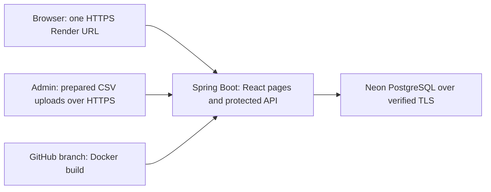

# SCAN demo hosting for $0

This is a small, occasional-use **technical demo**, not a production retailer deployment.
The repository is configured for one Render Free web service and one Neon Free PostgreSQL
project. The Neon project and SCAN schema are verified; you must still create the Render
service in your own account. Committing this configuration does not create a hosted app, and
no public Render URL has been verified yet.

## How it works



The root `Dockerfile` builds React, copies its production files into the Java application,
and packages everything in a Java 21 container. Node and Maven are build tools only; they
do not run in the final service. Spring Boot serves the dashboard at `/` and the API at
`/api/v1/...`, so browser requests stay on the same origin. No CORS change or Vercel proxy
is needed for this demo.

Only the page assets and minimal `GET /health` response are public. `scan-admin` can import
and map products; `scan-cci` can read aggregates for retailers with CCI sharing enabled.
Passwords stay in Render's environment settings and in browser memory during sign-in, not
in the frontend build or Git. Use **new, different hosted passwords**, not the local ones.

Flyway creates the database schema on startup. Imported receipts, mappings, and job history
live in Neon and survive app restarts. Uploaded source files are not archived by SCAN: retain
secure originals locally. Never rely on the container filesystem for durable data.

## 1. Use the configured Neon Free database

The verified Neon resources are:

| Resource | Value |
|---|---|
| Organization | `SCAN` (`org-orange-lake-78991410`) |
| Project | `SCAN` (`withered-darkness-12839995`) |
| Region / PostgreSQL | AWS Frankfurt / PostgreSQL 18 |
| Branch | `production` |
| Application database | `scan` |
| Application role | `scan_app` |

The application role owns its database and can run Flyway without using the default
`neondb_owner` role. Keep the role password private and enter it directly into Render in the
next step; do not paste credentials into chat, GitHub, source files, or deployment logs.

Before importing real or non-public data, reset the original `neondb_owner` password from
Neon's **Connect** dialog. Its first connection string was shared outside a secret manager.
The deployed application does not use that role, so this rotation does not change the Render
variables below.

Use this **direct JDBC** URL:

```text
jdbc:postgresql://ep-weathered-haze-b1xkw5un.c-5.eu-central-1.aws.neon.tech:5432/scan?sslmode=verify-full&sslfactory=org.postgresql.ssl.DefaultJavaSSLFactory
```

Do not use the `-pooler` hostname for this initial deployment: SCAN's datasource also runs
Flyway migrations. Do not include the username or password in the URL; supply them as separate
variables. Retrieve the current private connection details from Neon when needed:

```bash
neon connection-string production \
  --project-id withered-darkness-12839995 \
  --role-name scan_app \
  --database-name scan
```

Run that only in your private terminal. The command displays a credential, so never paste its
output into chat. For local development, prefer `bash scripts/run-neon-api.sh`; it retrieves
the same value in memory without displaying or storing the database password.

`verify-full` checks the server certificate and hostname, using Java's default trusted CAs.
Do not remove TLS verification to fix a connection error; check the hostname and certificate
error first. See the [PostgreSQL JDBC SSL documentation](https://jdbc.postgresql.org/documentation/ssl/).
The JDBC path and all three Flyway migrations were verified on 2026-08-27. Render-to-Neon
connectivity remains a hosted verification step.

## 2. Create the Render Free service

In [Render](https://dashboard.render.com/), choose **New → Blueprint**, connect
`HuseynBlv/SCAN`, and select branch **`codex/phase-1-kaggle-cci-dashboard`**. Use the root
`render.yaml`. Do not choose `main` yet: the deployment work is initially on PR #2's branch.

Review the creation screen **before applying**:

- Exactly one new web service, `scan-demo`, using Docker and the **Free** instance type.
- Region: Frankfurt. Build context: repository root. Dockerfile: `./Dockerfile`.
- No Render database, persistent disk, worker, paid workspace, or paid add-on.
- If that name already belongs to another service, stop and choose a unique name in the
  Blueprint; do not accidentally reconfigure an existing service.

Render prompts for these three values:

| Render environment variable | Value |
|---|---|
| `SCAN_DB_URL` | The direct JDBC URL from step 1 |
| `SCAN_DB_USERNAME` | `scan_app` |
| `SCAN_DB_PASSWORD` | The private password for `scan_app` retrieved from Neon |

The Blueprint generates separate random `SCAN_ADMIN_PASSWORD` and `SCAN_CCI_PASSWORD`
values and sets `SPRING_PROFILES_ACTIVE=cloud`. Retrieve the generated passwords privately
from the service's Environment page after creation. Usernames remain `scan-admin` and
`scan-cci`. The app uses Render's `PORT` automatically; do not configure port forwarding.

Deploy the service and wait for the build and startup logs to complete. Copy the **actual
assigned HTTPS URL** from Render; the name may have an extra suffix. Do not assume that
`scan-demo.onrender.com` is yours. Fill in the pending URL in `CLAUDE.md` once verified.

For a strict $0 budget, remain on free plans and do not add a payment method or accept an
upgrade. If signup requires a card or the review screen shows a charge, stop. Free quotas
can suspend service; do not enable paid overages to work around them.

## 3. Check the empty hosted app

Open the Render URL in a browser. The SCAN sign-in page should appear. A cold start can
take a minute or more; wait and reload before troubleshooting credentials.

From a terminal, replace the placeholder with your real URL, without a trailing slash:

```bash
export SCAN_DEMO_URL='https://YOUR_ASSIGNED_HOST.onrender.com'
curl --fail-with-body "$SCAN_DEMO_URL/health"
curl -i "$SCAN_DEMO_URL/api/v1/analytics/overview?retailerCode=KAGGLE"
curl --fail-with-body -u scan-cci \
  "$SCAN_DEMO_URL/api/v1/analytics/overview?retailerCode=KAGGLE"
```

Expected: health returns `{"status":"UP"}`, the unauthenticated API request returns **401**,
and the authenticated request returns **200** with zero baskets before import. Curl prompts
for the **hosted** CCI password. A health response checks application liveness only, not
database reachability; the authenticated analytics request checks the database path.

## 4. Load the bounded demo sample

Prepare the 10,000-receipt files using the [Kaggle guide](kaggle-demo.md#1-prepare-a-bounded-sample),
or reuse your existing generated files. Do not upload the original ZIP or unfiltered source.
The container deliberately includes neither the dataset nor credentials.

From the repository root, run these **one at a time**. Curl prompts for the hosted admin
password each time. Allow the import to finish before refreshing analytics or uploading again.

```bash
curl --fail-with-body -u scan-admin \
  -F retailerCode=KAGGLE \
  -F file=@scan-api/target/kaggle-demo/product-catalog.csv \
  "$SCAN_DEMO_URL/api/v1/product-mappings/catalog-imports"

curl --fail-with-body -u scan-admin \
  -F retailerCode=KAGGLE -F profileCode=KAGGLE_2019 \
  -F file=@scan-api/target/kaggle-demo/canonical-transactions.csv \
  "$SCAN_DEMO_URL/api/v1/imports"
```

Catalog first, transactions second. Check that the transaction response says `COMPLETED`.
The database starts separately from your laptop database: local imports are not automatically
copied to Neon. If a request times out, inspect Render's logs and import status before retrying;
do not start concurrent imports. A successfully completed identical upload is idempotent.

Sign into the hosted page with retailer `KAGGLE`, username `scan-cci`, and the generated
CCI password. For the identified source ZIP and a fresh demo retailer, verify:

| Check | Expected |
|---|---:|
| Baskets | 10,000 |
| Imported lines | 54,848 |
| CCI baskets | 209 |
| CCI penetration | 2.1% |
| Mapped lines | 100% |

Check all five dashboard tabs. Repeat the transaction upload: `duplicateFile` should be
`true` and totals unchanged. Confirm that `scan-cci` receives **403** for
`/api/v1/product-mappings/catalog`. Restart the app from Render and verify the same totals.
Only then share the demo link and CCI credentials privately. Do not share admin credentials.

## Free-plan expectations and safeguards

Limits checked against provider documentation on **2026-08-26**; review them again at signup.

- Render Free provides 512 MB RAM and 0.1 CPU. This app sets a 256 MB Java heap, small thread
  and database pools, and runs as a non-root user. This is a capacity constraint, not an SLA.
  [Instance specifications](https://render.com/docs/compute-plans).
- Render sleeps after 15 minutes without inbound traffic; waking normally takes about a
  minute. Its 750 monthly free instance hours are shared across the workspace. Bandwidth
  and build allowances also apply, and high outbound database traffic can trigger suspension.
  No keep-awake pings are configured. Render's free PostgreSQL expires after 30 days, so this
  setup uses Neon instead. [Free-service limitations](https://render.com/docs/free).
- Neon Free currently includes 0.5 GB storage per project, 100 CU-hours per project/month,
  and 5 GB public network transfer, with idle scale-to-zero. Check usage after imports and
  avoid additional copies/branches of the dataset. Keep a recoverable source copy; the free
  restore window is limited. [Neon pricing](https://neon.com/pricing).
- Use only the prepared, de-identified demo data. Real retailer hosting requires explicit
  data-sharing approval, retention/backup decisions, appropriate accounts, and security review.
- Imports are synchronous and analytics load receipts into memory. Do not import the full
  Kaggle source or assume concurrent retailer-scale traffic fits this free service.

## Local container verification

With Docker running, from the repository root:

```bash
docker build --tag scan-demo:local .
bash scripts/smoke-container.sh scan-demo:local
```

The script creates its own disposable PostgreSQL 17 database and a read-only, non-root app
container with a **512 MB memory limit**. It checks real frontend assets, a non-default port,
public health, authentication/role boundaries, imports, duplicate prevention, and persistence
across an app restart. It never uses your host's `SCAN_DB_*` values or laptop PostgreSQL.
On exit it removes only its temporary containers, their test data, and its temporary network.

To exercise the prepared 10,000-basket sample under the same memory limit:

```bash
SCAN_SMOKE_KAGGLE_DIR="$PWD/scan-api/target/kaggle-demo" \
  bash scripts/smoke-container.sh scan-demo:local
```

GitHub CI runs the small-fixture container test after the backend and frontend checks.
The optional dataset is not committed or uploaded to CI. Local Docker results do not prove
Render's CPU speed, cold-start time, Neon connectivity, or behavior under concurrent traffic;
the hosted checks above are still required.

Local verification on 2026-08-26 passed with Java 21, PostgreSQL 17, and the 512 MB app limit:
the prepared sample produced 10,000 baskets, 209 CCI baskets, and 100% mapped lines, including
after an application restart. The final memory snapshot was about 444 MiB (not a peak
measurement). This leaves limited headroom; do not treat the run as a concurrency benchmark.

## Updates, GitHub, and Vercel

Service auto-deploy is **off**. After CI passes, use Render's **Manual Deploy** for the
selected commit. Blueprint configuration changes may also trigger deployment when synced;
review the proposed changes and disable automatic Blueprint sync if you require every
configuration update to be manual. See [Render's Blueprint reference](https://render.com/docs/blueprint-spec).

PR #2 stays open until the hosted demo is verified and the existing Vercel production impact
is resolved. This work does not change Vercel routing or deploy Spring Boot there. Merging
the branch can still update that existing frontend, which currently has no hosted API route.

After an approved merge, change the service branch in `render.yaml` and Render to `main`,
then manually deploy and recheck it. Do not delete the feature branch while Render still
depends on it. Record the actual URL and verified deployment status in `CLAUDE.md` and the
PR. Never commit hosted passwords, database connection credentials, or private exports.

## Troubleshooting

| Symptom | Next check |
|---|---|
| Build cannot pull an image locally | Check Docker Hub authentication/network access; this happens before SCAN runs. Do not change app passwords. |
| Deploy fails during Flyway startup | Check the JDBC prefix, direct Neon hostname, database, role permissions, and password in Render. Do not paste full connection strings into public logs/issues. |
| TLS certificate verification fails | Verify the hostname and trusted certificate chain; do not disable verification. |
| `/health` is 200 but analytics fails | Liveness is not database health. Check Neon quota/connectivity and Render application logs. |
| Sign-in returns 401 | Use the generated Render CCI password, not your laptop password or the Neon database password. |
| Sign-in returns 403 | Check account role and the retailer's CCI-sharing permission. |
| 502/503/504 after inactivity | Wait for wake-up and retry. Check service logs and quota status if it persists. |
| App exits with an out-of-memory error | Stop repeated/concurrent imports; inspect the dataset size and logs. Do not silently upgrade the plan. |
| Empty dashboard after deployment | Import catalog and transactions into the hosted API, then use the matching retailer code. |
